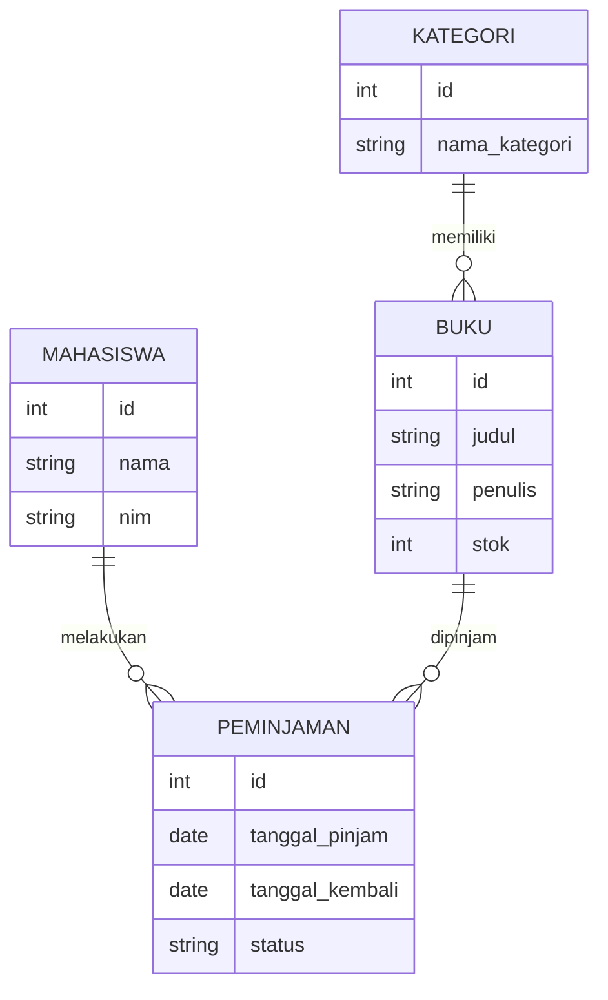

# Entity Relationship Diagram (ERD)

```mermaid
erDiagram

KATEGORI ||--o{ BUKU : memiliki
MAHASISWA ||--o{ PEMINJAMAN : melakukan
BUKU ||--o{ PEMINJAMAN : dipinjam

KATEGORI {
int id
string nama_kategori
}

BUKU {
int id
string judul
string penulis
int stok
}

MAHASISWA {
int id
string nama
string nim
}

PEMINJAMAN {
int id
date tanggal_pinjam
date tanggal_kembali
string status
}
```